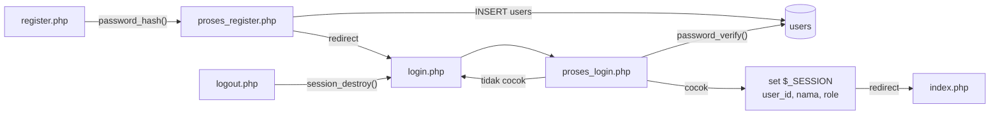

# 📘 Dokumentasi SIMPUS-Mini — Jobsheet 10

Panduan singkat mengenai struktur dan fitur proyek **SIMPUS-Mini** (Sistem Perpustakaan Mini) pada Jobsheet 10.

## 👤 Identitas Mahasiswa

| Keterangan | Detail |
| :--- | :--- |
| **Nama** | Jonathan Emmanuel Kristanto |
| **Kelas** | 2F/TI |
| **Absen** | 20 |

## 📂 Struktur Proyek

```
jobsheet-10/
├── index.php                 # Beranda (publik) + ringkasan + tombol Reset (khusus admin)
├── reset.php                 # Kosongkan tabel buku & anggota — wajib login + role admin
├── includes/
│   ├── header.php            # Bagian atas HTML + navbar dinamis + status login
│   ├── footer.php            # Bagian bawah HTML + footer
│   ├── koneksi.php           # Koneksi PDO driver pgsql
│   ├── auth.php              # Guard clause: halaman wajib login
│   └── remember.php          # Pemulihan sesi dari cookie "Ingat Saya"
├── auth/
│   ├── register.php          # Form registrasi petugas
│   ├── proses_register.php   # password_hash() + cek username duplikat
│   ├── login.php             # Form login + checkbox "Ingat saya"
│   ├── proses_login.php      # password_verify() + pembatas percobaan gagal
│   └── logout.php            # session_destroy() + hapus token "Ingat Saya"
├── sql/
│   ├── 01_buku_anggota.sql   # Skema tabel buku & anggota
│   ├── 02_tanggal_ditambahkan.sql  # Kolom tambahan pada tabel buku
│   ├── 03_users.sql          # Tabel users (nama, username, password, role)
│   ├── 04_remember_token.sql # Kolom remember_token (latihan "Ingat Saya")
│   └── migrasi_json.php      # Impor data dari jobsheet-06
├── assets/
│   ├── css/
│   │   └── style.css         # Stylesheet global + gaya .auth-status
│   └── js/
│       └── app.js            # Hamburger, konfirmasi Hapus/Update, filter, validasi form
├── buku/
│   ├── list.php              # Read + pagination + pencarian (publik); tombol Hapus khusus admin
│   ├── tambah.php            # Form tambah buku (wajib login)
│   ├── proses_tambah.php     # INSERT via prepared statement (wajib login)
│   ├── edit.php              # Form edit terisi data lama (wajib login)
│   ├── proses_edit.php       # UPDATE ... WHERE id = :id (wajib login)
│   └── hapus.php             # DELETE (wajib login + role admin)
├── anggota/                  # Struktur sama; SELURUH halaman wajib login
│   ├── list.php, tambah.php, proses_tambah.php
│   ├── edit.php, proses_edit.php
│   └── hapus.php             # + role admin
├── docs/
│   ├── wireframe.md          # Rancangan UI
│   └── jawaban.md            # Jawaban soal jobsheet
├── Infografis.png            # Infografis proyek
├── Dokumentasi/
│   └── PANDUAN.md            # Dokumentasi ini
└── README.md                 # Laporan pengerjaan jobsheet
```

## 🧭 Penjelasan Folder

- **`index.php`** — Beranda publik: ringkasan jumlah buku/anggota dari database. Tombol **Reset Data** hanya muncul untuk admin.
- **`reset.php`** — Mengosongkan tabel `buku` dan `anggota` (`TRUNCATE ... RESTART IDENTITY`). Karena destruktif, wajib login **dan** ber-role `admin`.
- **`includes/koneksi.php`** — Koneksi PDO ke PostgreSQL, dipanggil dengan `require` oleh halaman yang butuh database.
- **`includes/auth.php`** — Penjaga halaman: mengalihkan pengunjung yang belum login ke halaman Login. **Harus di-`require` sebagai baris pertama**, sebelum `header.php`.
- **`includes/remember.php`** — Memulihkan sesi dari cookie "Ingat Saya" (latihan §6.4 no. 2). Hanya memuat koneksi database bila cookie benar-benar ada.
- **`includes/header.php`** / **`footer.php`** — Bagian atas dan bawah HTML bersama semua halaman. `header.php` juga menghitung `$base` (path relatif otomatis), `$sudahLogin`, dan merender navbar dinamis.
- **`auth/`** — Seluruh proses masuk-keluar: registrasi, login, logout.
- **`sql/`** — Berkas skema database dan skrip migrasi data.
- **`assets/js/app.js`** — Interaktivitas: menu hamburger, konfirmasi Hapus (event `submit`), konfirmasi Update, filter tabel sisi klien, counter baris, validasi form.
- **`buku/`** dan **`anggota/`** — Halaman pengelolaan data dengan pola 4 file: `list.php` (Read), `tambah.php` + `proses_tambah.php` (Create), `edit.php` + `proses_edit.php` (Update), `hapus.php` (Delete).

## 🗄️ Skema Database

Database `simpus_mini` berisi tiga tabel:

| Tabel | Kolom |
| :--- | :--- |
| `buku` | `id`, `judul`, `pengarang`, `tahun`, `isbn`, `stok`, `kategori`, `tanggal_ditambahkan` |
| `anggota` | `id`, `nama`, `no_anggota`, `alamat`, `no_hp`, `email` |
| `users` | `id`, `nama`, `username` (UNIQUE), `password` (hash), `role`, `remember_token` |

Batasan yang dipakai: `PRIMARY KEY` pada `id`, `NOT NULL` pada kolom wajib, `DEFAULT 0` pada `stok`, `DEFAULT 'petugas'` pada `role`, `UNIQUE` pada `no_anggota` dan `username`.

**Kolom `password` menyimpan hash, bukan password asli.** Panjangnya `VARCHAR(255)` supaya cukup menampung hash dari algoritma apa pun yang dipilih `PASSWORD_DEFAULT`.

## 🔐 Autentikasi & Otorisasi

| Istilah | Pertanyaan | Wujud di proyek ini |
| :--- | :--- | :--- |
| **Autentikasi** | "Kamu siapa?" | Login dengan `password_verify()` |
| **Otorisasi** | "Kamu boleh apa?" | `includes/auth.php` (wajib login) + cek `role` untuk operasi hapus |

### Alur lengkap



### Halaman publik vs terkunci

| Halaman | Akses |
| :--- | :--- |
| `index.php` (Beranda) | Publik — tamu boleh membuka |
| `buku/list.php` (katalog) | Publik — tamu boleh membuka |
| `auth/login.php`, `auth/register.php` | Publik (dan dialihkan ke Beranda bila sudah login) |
| `buku/tambah.php`, `edit.php`, `proses_*.php` | **Wajib login** |
| `buku/hapus.php` | **Wajib login + role `admin`** |
| Seluruh halaman `anggota/*` | **Wajib login** (`hapus.php` juga wajib `admin`) |
| `reset.php` | **Wajib login + role `admin`** |

### Kunci penerapan

- **`auth.php` harus jadi baris pertama.** `header('Location: ...')` gagal bila HTML sudah mulai dicetak. Urutan yang benar:
  ```php
  <?php
  require __DIR__ . '/../includes/auth.php';   // dulu
  $page_title = "Tambah Buku";
  include __DIR__ . '/../includes/header.php'; // baru cetak HTML
  ```
- **`session_status()` sebelum `session_start()`.** Karena `session_start()` dipanggil dari banyak berkas (`auth.php`, `header.php`, `login.php`, …), pemanggilan ganda dalam satu permintaan akan memicu peringatan. Pola `if (session_status() === PHP_SESSION_NONE) { session_start(); }` membuatnya aman dipanggil berkali-kali.
- **Guard tidak menyentuh database.** `auth.php` hanya memeriksa `$_SESSION`, jadi halaman terkunci tetap mengalihkan tamu ke Login **meski PostgreSQL sedang mati**.
- **Path redirect dihitung otomatis.** `auth.php` menghitung kedalaman folder halaman yang sedang dibuka (teknik sama dengan `$base`), sehingga benar untuk `buku/`, `anggota/`, maupun `reset.php` yang ada di root.
- **Menyembunyikan menu bukan keamanan.** Menu dan tombol disembunyikan demi kerapian tampilan; proteksi sesungguhnya ada di `auth.php` dan cek `role` di berkas pemroses. Mengetik URL langsung tetap diblokir.

## 🧩 Latihan yang Dikerjakan (§6.4)

| No | Latihan | Wujudnya |
| :--- | :--- | :--- |
| 1 | Kontrol akses berbasis `role` | `buku/hapus.php`, `anggota/hapus.php`, `reset.php` menolak non-admin; tombol Hapus & Reset hanya dirender untuk admin |
| 2 | "Ingat Saya" | `includes/remember.php` + kolom `remember_token`; cookie `HttpOnly` + `SameSite=Lax`, 30 hari; database menyimpan **hash** token; token diputar tiap dipakai |
| 3 | Pembatas percobaan login | 5 kegagalan → kunci 60 detik; selama terkunci permintaan ditolak sebelum menyentuh database; sisa percobaan ditampilkan |
| 4 | Uji guard saat database mati | Halaman terkunci tetap 302 ke Login saat database tidak terjangkau |

**Catatan keamanan "Ingat Saya":** cookie berumur panjang selalu lebih berisiko daripada sesi biasa — siapa pun yang memegang isi cookie itu bisa masuk sebagai pengguna tersebut. Karena itu yang disimpan di database adalah hash-nya (bukan token asli), token diputar setiap kali dipakai, dan logout menghapus token di kedua sisi (database + cookie).

## 🔄 Alur CRUD (setelah Jobsheet 10)

| Operasi | Alur | Syarat |
| :--- | :--- | :--- |
| **Create** | `tambah.php` → `proses_tambah.php` (validasi → `INSERT`) → `list.php` | Login |
| **Read** | `list.php` → `SELECT ... LIMIT/OFFSET` (+ `COUNT(*)` & `ILIKE` bila mencari) | Publik (katalog) |
| **Update** | `list.php` → `edit.php?id=...` → `proses_edit.php` (`UPDATE ... WHERE id`) → `list.php` | Login |
| **Delete** | `list.php` → `POST hapus.php` (`DELETE ... WHERE id`) → `list.php` | Login + role `admin` |

Setiap langkah pemrosesan diakhiri **flash message** di `$_SESSION` yang tampil sekali di halaman berikutnya. Bila validasi gagal saat Update, pengguna dikembalikan ke `edit.php?id=...` — bukan ke form kosong.

## 🛡️ Validasi Server-Side

| Data | Aturan |
| :--- | :--- |
| Judul / Nama | Wajib diisi |
| Pengarang | Wajib diisi |
| Tahun | Angka antara 1900–2026 |
| Stok | Angka, tidak negatif |
| ISBN | Bila diisi, hanya angka dan tanda hubung |
| No. Anggota | Wajib diisi, harus unik (Create & Update) |
| No. HP | Bila diisi, hanya angka, tanda hubung, dan tanda plus |
| Email | Bila diisi, harus format email yang valid |
| Nama / Username (registrasi) | Wajib diisi |
| Password (registrasi) | Minimal 6 karakter |

Seluruh nilai yang masuk ke query dikirim lewat placeholder (`:nama`), bukan digabung ke dalam string SQL.

## 🔐 GET vs POST

- `GET` untuk operasi **aman/dibaca**: menampilkan halaman, pagination (`?page=2`), pencarian (`?q=...`), membuka form edit (`?id=...`).
- `POST` untuk operasi yang **mengubah data**: Create, Update, Delete, Login, Registrasi, Reset Data.
- `hapus.php` menolak permintaan non-`POST` dan langsung mengalihkan ke `list.php`.
- Konfirmasi Hapus dan Update dilakukan di event `submit` (bukan `click`) sehingga bisa dibatalkan dengan `preventDefault()` **sebelum** request terkirim.
- `UPDATE`/`DELETE` **selalu** disertai `WHERE id = :id`.

## 🚀 Cara Menjalankan

Persiapan database (sekali saja):

```bash
sudo -u postgres createdb simpus_mini
psql -d simpus_mini -f sql/01_buku_anggota.sql
psql -d simpus_mini -f sql/02_tanggal_ditambahkan.sql
psql -d simpus_mini -f sql/03_users.sql
psql -d simpus_mini -f sql/04_remember_token.sql
```

Jalankan aplikasi:

```bash
php -S localhost:8000
```

Lalu buka `http://localhost:8000/index.php`. **Akun pertama harus dibuat sendiri**: buka Login → "Daftar di sini". Untuk mencoba fitur admin:

```sql
UPDATE users SET role = 'admin' WHERE username = 'username_anda';
```

## 📌 Catatan

- Data tetap **persisten** di PostgreSQL; menutup browser tidak menghapusnya.
- Tabel `users` **tidak** ikut dikosongkan oleh tombol Reset Data (hanya `buku` dan `anggota`), supaya akun tidak hilang saat data contoh dibersihkan.
- `sql/migrasi_json.php` mengisi tabel `buku` dari `jobsheet-06/data/buku.json`; menjalankannya dua kali akan menggandakan data.
- Audit keamanan menyeluruh (XSS, CSRF, session fixation) direncanakan pada Jobsheet 11. Yang **belum** ada di jobsheet ini: token CSRF pada form POST, dan `session_regenerate_id()` setelah login.
